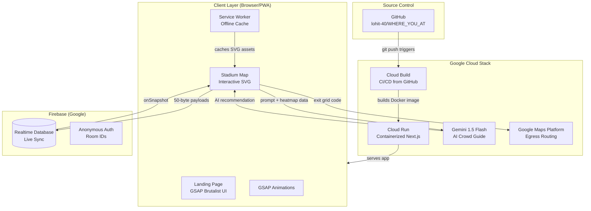
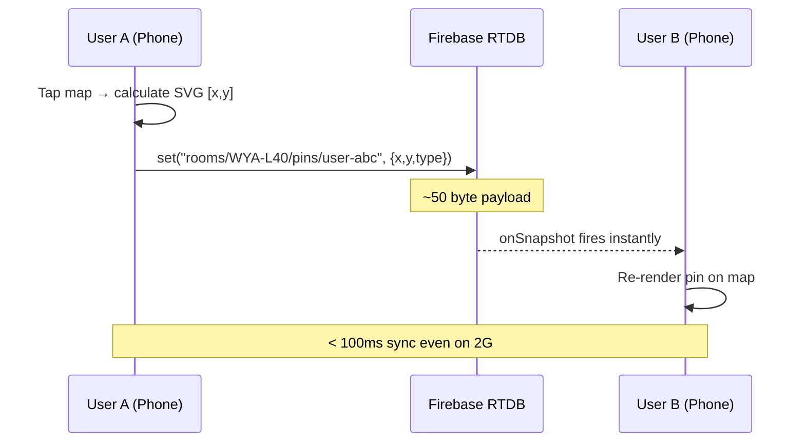
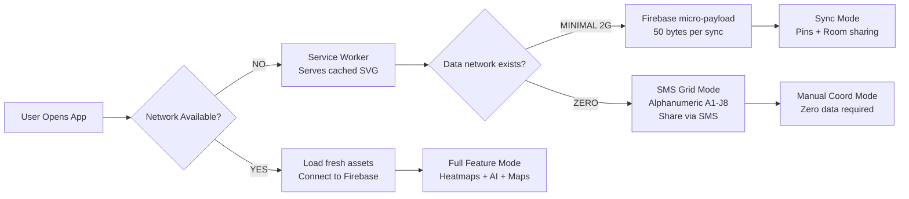
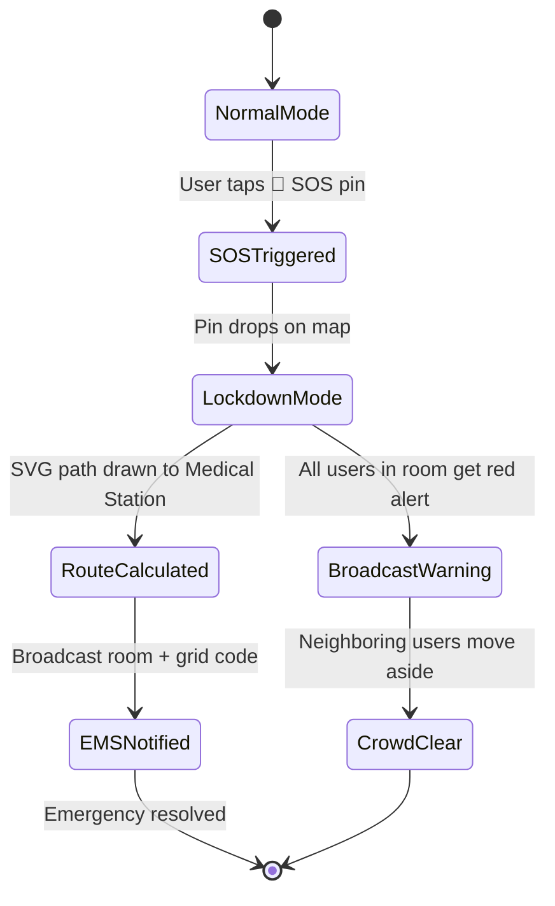

# WhereYouAt 🏟️

> **Google PromptWars 2026 Submission** — Solving real-time crowd coordination in high-congestion stadium environments where cellular networks fail.

[](https://whereyouat-817653978552.us-central1.run.app)
[](https://firebase.google.com)
[](https://nextjs.org)
[](https://web.dev/progressive-web-apps/)

---

## 🎯 The Problem

At a sold-out 80,000-seat stadium event, **three things always fail simultaneously:**

| Problem | Impact |
|---------|--------|
| 📶 Cell towers get overloaded | Standard maps & messaging apps go offline |
| 🗺️ Venue maps don't show crowd density | People walk into 30-min queues unknowingly |
| 🚨 Emergency coordination breaks down | EMS can't navigate crowd efficiently |

**WhereYouAt** is engineered from first principles to work *specifically* in these hostile network environments.

---

## ✨ Features

### 🔴 Core Capabilities
- **Real-time Location Sync** — Firebase Realtime Database pushes micro-payload `[x,y]` coordinates (~50 bytes) per update, designed to squeeze through congested 2G networks
- **Offline-First Architecture** — Full stadium SVG map cached via Service Workers before the event starts. Works at zero connectivity.
- **SMS Grid Fallback** — Alphanumeric A1–J8 grid overlay lets users share location via standard SMS text ("Meet me at C4") when data is completely gone

### 🟠 Advanced Features
- **Live Queue Heatmaps** — SVG glow overlays showing Severe / Moderate / Clear wait times at gates, concessions, and bathrooms
- **Contextual Intent Pings** — Drop specific pins: 📍 Generic, 🍔 Food, 🚻 WC, 🚨 SOS
- **First Responder Engine** — SOS pings trigger Lockdown Mode with dynamic SVG routing line drawn to nearest medical station
- **Egress Flow Control** — Color-coded post-game exit zones distribute crowds across gates, reducing parking lot gridlock

### 🔵 Google Cloud Integration
- **Vertex AI / Gemini** — "Ask Gemini" button reads live heatmap data and gives personalized crowd routing recommendations in natural language
- **Google Cloud Run** — Entire application deployed as a containerized service on Google's serverless infrastructure
- **Google Maps Platform** — Exit Strategy mode links to real-world Google Maps turn-by-turn egress directions
- **Firebase Realtime DB** — Sub-100ms synchronization across all connected devices in the same room

### 🟡 Monetization Demo
- **VIP Fast Lane** — Demonstrates stadium revenue model via digital upgrade pass for priority egress and concessions routing

---

## 🏗️ Architecture



---

## 📡 Data Flow — Real-Time Sync



---

## 🌐 Offline Strategy — The Crown Jewel



---

## 🚨 First Responder Engine — SOS Flow



---

## 🛠️ Tech Stack

| Layer | Technology | Why |
|-------|-----------|-----|
| **Framework** | Next.js 16 (App Router) | Server components + PWA support |
| **Styling** | Tailwind CSS v4 + Custom CSS | Brutalist design system |
| **Animations** | GSAP 3 + `@gsap/react` | Marquee + button physics |
| **UI Transitions** | Framer Motion | Modal animations |
| **Map** | Custom SVG + `react-zoom-pan-pinch` | Works fully offline |
| **Real-time DB** | Firebase Realtime Database | Sub-100ms, 2G-friendly |
| **AI** | Google Gemini 1.5 Flash (`@google/generative-ai`) | Crowd routing intelligence |
| **Offline** | `next-pwa` + Service Workers | Full asset precaching |
| **Containerization** | Docker (multi-stage build) | Cloud Run deployment |
| **CI/CD** | Google Cloud Build | Auto-deploy on git push |
| **Hosting** | Google Cloud Run | Serverless, auto-scaling |

---

## 📁 Project Structure

```
WHERE_YOU_AT/
├── src/
│   ├── app/
│   │   ├── page.tsx          # 🏠 Landing page (GSAP Brutalist design)
│   │   ├── map/
│   │   │   └── page.tsx      # 🗺️  Main app (Room sync, heatmap, AI)
│   │   ├── layout.tsx        # Root layout
│   │   └── globals.css       # Tailwind v4 + tactical grid background
│   ├── components/
│   │   └── StadiumMap.tsx    # 🏟️  SVG map with heatmap + egress zones
│   └── lib/
│       └── firebase.ts       # 🔥 Firebase Realtime DB connection
├── Dockerfile                # Multi-stage production container
├── cloudbuild.yaml           # Google Cloud Build CI/CD pipeline
├── next.config.ts            # PWA + standalone output config
└── public/
    └── sw.js / workbox-*.js  # Generated Service Workers
```

---

## 🚀 Deployment

### Google Cloud Run (Production)

```bash
# The cloudbuild.yaml handles this automatically on git push
# Manual deploy via Cloud Shell:
gcloud run deploy whereyouat-app \
  --source . \
  --region us-central1 \
  --allow-unauthenticated \
  --port 3000 \
  --project promptwar-8a1b6
```

### Environment Variables (Required in Cloud Run)

```env
NEXT_PUBLIC_FIREBASE_API_KEY=
NEXT_PUBLIC_FIREBASE_AUTH_DOMAIN=
NEXT_PUBLIC_FIREBASE_DATABASE_URL=
NEXT_PUBLIC_FIREBASE_PROJECT_ID=
NEXT_PUBLIC_FIREBASE_STORAGE_BUCKET=
NEXT_PUBLIC_FIREBASE_MESSAGING_SENDER_ID=
NEXT_PUBLIC_FIREBASE_APP_ID=
NEXT_PUBLIC_GEMINI_API_KEY=         # optional - falls back to demo mode
```

### Local Development

```bash
git clone https://github.com/lohit-40/WHERE_YOU_AT.git
cd WHERE_YOU_AT
npm install
cp .env.example .env.local   # add your Firebase keys
npm run dev                  # runs on http://localhost:3000
```

---

## 📱 How To Use

1. **Open the app** on your phone before the game (Service Worker caches the map)
2. **Create a Room** — tap "INITIALIZE" to generate a 6-char room code
3. **Share the code** with your group via SMS/WhatsApp
4. **Your group joins** — tap "JOIN" and type the code
5. **Drop pins** — tap anywhere on the stadium SVG to broadcast location
6. **Toggle Heatmap** — see live crowd density at gates and bathrooms
7. **SOS mode** — triggers emergency routing and group-wide lockdown alert
8. **Exit Strategy** — enables color-coded egress zones + Google Maps launch

---

## 🏆 PromptWars Challenge: Physical Event Experience

### Problem Statement Addressed
> *"How can technology improve the experience of attending large physical events?"*

### Our Engineering Insight
Most "event apps" assume reliable internet. We started with **the constraint** — no internet — and built up from there.

Instead of a map app with offline fallback, we built an **offline coordination tool** with online enhancements.

### Key Technical Differentiators
- ✅ 50-byte micro-payloads vs. typical 5KB+ JSON responses
- ✅ Service Worker pre-caching before connectivity is lost
- ✅ SMS coordinate fallback (works on any phone, zero data)
- ✅ Gemini AI reads live SVG state for contextual routing
- ✅ Deployed on Google Cloud Run with full CI/CD pipeline

---

## 📄 License

MIT © 2026 lohit-40

---

*Built with Google Antigravity AI for the PromptWars 2026 Virtual Hackathon*
